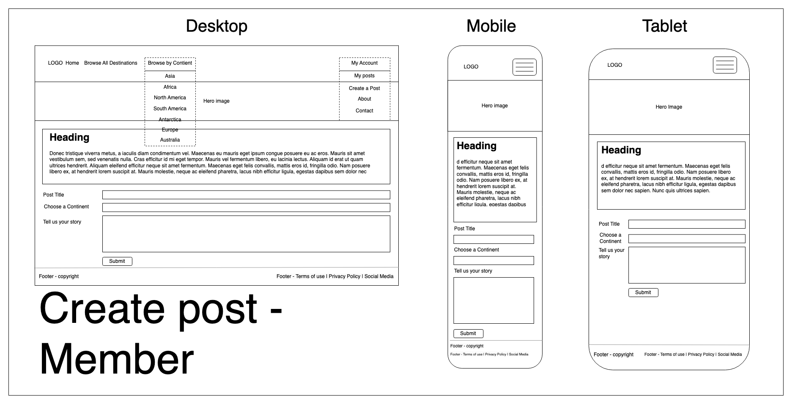

<!-- omit in toc -->
# **Coder Academy - Assignment T3A2 Part A - Full Stack MERN App Documentation: Submitted by Mario Lisbona and Callum Rowston**

<!-- omit in toc -->
## Table of Contents
- [**R1 - Description of your website**](#r1---description-of-your-website)
  - [Purpose](#purpose)
  - [Functionality / Features](#functionality--features)
  - [Target Audience](#target-audience)
  - [Tech Stack](#tech-stack)
- [**R2 - Dataflow Diagrams**](#r2---dataflow-diagrams)
- [**R3 - Application Architecture Diagram**](#r3---application-architecture-diagram)
- [**R4 - User Stories**](#r4---user-stories)
- [**R5 - Wireframes for Desktop, Mobile and Tablet**](#r5---wireframes-for-desktop-mobile-and-tablet)
- [**R6 - Screenshots of your Trello board**](#r6---screenshots-of-your-trello-board)
  - [Planning Methodology](#planning-methodology)
  - [Links](#links)

## **R1 - Description of your website**

### Purpose

This project aims to provide an online forum to allow people to share their travel stories, with the hope of creating social connections and a sense of community through users' shared love of travel. By having members share their travel stories, they are providing valuable information through a personal lens that other users can use to help plan their next adventure.

### Functionality / Features

- Read the latest travel stories
- Find travel stories from your favourite continent
- Site Navigation
- Member Account Creation
- Post your travel story
- Comment on posts

Additional features to be added if time allows:

- Allow members to rate posts
- Allow members to add posts to their 'favourites'

### Target Audience

This application is aimed at people wishing to read travel stories written by others about their adventures around the world. It is also for people wishing to share their own travel stories and have discussions about these stories with an online community.

### Tech Stack

**Front-end**

- HTML
- CSS
- JavaScript
- [React.js](https://reactjs.org/)
- [Bootstrap](https://getbootstrap.com/)

**Back-end**

- [Node.js](https://nodejs.org/en/)
- [Express.js](https://expressjs.com/)
- [Mongoose](https://mongoosejs.com/)

**Database**

- [MongoDB](https://www.mongodb.com/atlas/database)

**Deployment**

- [Netlify](https://www.netlify.com/)
- [Railway](https://railway.app/)

**Testing**

- [Vitest](https://vitest.dev/)
- [Jest](https://railway.app/)

**Project Management**

- [Trello](https://trello.com)
- [Google Drive](https://www.google.com/intl/en_au/drive/)
- [Discord](https://discord.com/)

**DevOps Tools**

- [Git](https://git-scm.com/)
- [GitHub](https://github.com/)
- [VS Code](https://code.visualstudio.com/)

**Design Tools**

- [Lucidchart](https://www.lucidchart.com/pages/)
- [Draw.io](https://app.diagrams.net/)

## **R2 - Dataflow Diagrams**

## **R3 - Application Architecture Diagram**

## **R4 - User Stories**

Initial user stories were created to outline desired features that reflect the projects intended audience and purpose.

Stage One - User - All / Guest

 

- As a user I want a navigation bar to show me what is on the site.
- As a user I want to read travel stories posted on the forum.
- As a user I want to see a post preview before viewing the entire post
- As a user I want to see the latest forum posts.
- As a user I want to see posts about a particular continent .
- As a user I want to read other users' comments on travel posts.
- As a user I want to be able to view an about page with information about the websites intended purpose and other background information.
- As a user I want to be able to view a contact page so I can message the creators about any issues with the website.
- As a user I want to be able to sign up to the forum.

Stage One - User - Member

 

- As a member I want to write and post my own travel stories.
- As a member I want to comment on other members' posts .
- As a member I want to view a list of all the posts I have made
- As a member I want to comment on my own posts.
- As a member I want to be able to edit posts I have already made.
- As a member I want to be able to delete a post I made.

 

User stories were then revised to reflect any changes to features and to provide context for why specific features will be developed.

Stage Two - User - All / Guest

 

- As a user I want a navigation bar to show me what is on the site so I can navigate to my desired content.
- As a user I want to read travel stories posted on the forum so I can learn about other people's trips.
- As a user I want to see a post preview before viewing the entire post so I can decide if it will interest me.
- As a user I want to see the latest forum posts so I can keep up with current trends in travel and the forum community.
- As a user I want to see posts about a particular continent  so I can find out more about that region and if I want to travel there.
- As a user I want to read other users' comments on travel posts so I can see what others think to help me decide if I want to travel there.
- As a user I want to be able to view an about page with information about the websites intended purpose and other background information so I can get a better understanding of the creators intent
- As a user I want to be able to view a contact page so I can message the creators about any issues with the website
- As a user I want to be able to sign up to the forum so I can engage with and contribute to the forum community and use all the site features.

Stage Two - User - Member

 

- As a member I want to write and post my own travel stories so I can tell the forum community about my trips.
- As a member I want to comment on other members posts so I can ask them questions about their trip and tell them what I loved about their post.
- As a member I want to view a list of all the posts I have made so I can look back on my posts and easily navigate to them
- As a member I want to comment on my own posts so I can answer any questions and engage with the community interested in my travel story.
- As a member I want to be able to edit posts I have already made so I can fix any mistakes and keep my story up-to-date if I think of something I should have added..
- As a member I want to be able to delete a post I made so I can remove posts that I’ve decided I don’t like anymore.

 

## **R5 - Wireframes for Desktop, Mobile and Tablet**

Guest Wireframes

 

Member Wireframes

 

Color Pallet and Hero Image themes

 

## **R6 - Screenshots of your Trello board**

Screenshots were taken at least daily and are dated in the file name.

Trello Screenshots Part A

 

 

### Planning Methodology

We have chosen to implement an Agile workflow centered around the Kanban framework, by using Trello to delegate and manage tasks. This approach was chosen as it allows for flexibility and transparency throughout development and allows us to easily see the progress and workflow of each team member. We discussed who would take on each requirement and used the Kanban board to assign those tasks as agreed upon. A GitHub repository was set up for documentation that both group members had collaborator access to, allowing us to each work on separate tasks in our own branch and then merge them into the same document.

We also discussed our strengths and weaknesses and decided to split up responsibilities for the application development as so:

- Mario - Client / front-end
- Callum - Server / back-end

Cards were created in Trello and labelled as 'client' or 'server' and assigned to the appropriate member to help separate concerns.

We each set up a corresponding GitHub repository for our assigned sections and added the other as a collaborator. We agreed on a branching approach whereby each member works in a local branch and when finished, submits a pull request to merge it into the main branch once approved.

CI/CD will be utilised by linking the corresponding repository to our chosen deployment; Netlify for the client and Railway for the server. This will allow us to easily test the application during development.

### Links

- [Client GitHub Repository](https://github.com/MarioLisbona/CA-T3A2-B-travelers-forum-client)
- [Server GitHub Repository](https://github.com/CallumRowston/CA-T3A2-B-travelers-forum-server)
- [Trello Workspace](https://trello.com/invite/b/LD1ZUwnS/ATTIa1a5b199a938633ae2b66720915b02c4F4F552AD/t3a2-part-a-b)
